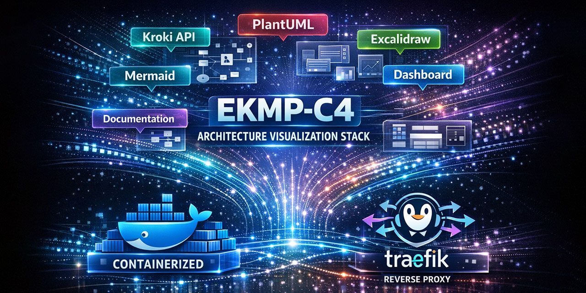

# EMPC4 Architecture Visualization Stack

**Containerized visualization environment for PlantUML, Mermaid, Excalidraw, and Kroki**

[](https://www.docker.com/)
[](https://docs.docker.com/compose/)
[](LICENSE)
[](CHANGELOG.md)
[](https://plantuml.com/)
[](https://mermaid.js.org/)
[](#about)

> 🇩🇪 [Deutsche Version](README_DE.md)

<p align="center">
  
</p>

---

## ✨ New: Real-Time Collaboration

<table>
<tr>
<td width="50%">

### PlantUML Live Collaboration
**Multiple users can edit the same diagram simultaneously!**

- 🔄 **Real-time sync** via WebSocket (Socket.IO)
- 👥 **Multi-device editing** - Windows, Linux, Mac
- 🔒 **Self-hosted** - no cloud dependency
- ⚡ **Instant updates** - see changes as they happen
- ✅ **Opt-in by design** - no sync without explicit consent
- 🏗️ **Architecture Design** - [`docs/docu/`](docs/docu)
Built with Flask-SocketIO + eventlet, integrated into the existing PlantUML Monaco Editor.

**Privacy first:** Sync is OFF by default. Click the toggle button to enable collaboration.

</td>
<td width="50%">

```
┌─────────────────────────────────────┐
│     Browser A        Browser B      │
│    (Windows)         (Ubuntu)       │
│        │                │           │
│        ▼                ▼           │
│   ┌─────────────────────────┐       │
│   │   plantuml-sync:5001    │       │
│   │   Flask-SocketIO        │       │
│   │   WebSocket Rooms       │       │
│   └─────────────────────────┘       │
│              │                      │
│              ▼                      │
│   ┌─────────────────────────┐       │
│   │  plantuml-backend:8080  │       │
│   │  Jetty + Monaco Editor  │       │
│   └─────────────────────────┘       │
└─────────────────────────────────────┘
```

</td>
</tr>
</table>

📖 **Architecture Diagrams:** [`docs/architecture/`](repo/docs/architecture/)

---

## 🎯 Overview

A fully local, containerized solution for architecture visualization and documentation. Combines "Architecture as Code" tools in one easy-to-use stack with custom enhancements.

| Service | Description | Custom Features |
|---------|-------------|-----------------|
| 🏠 **Dashboard** | Central entry point | Health monitoring |
| 🎨 **PlantUML** | UML & C4 diagrams | **Real-time collaboration** |
| 🌊 **Mermaid Live** | Interactive diagrams | Save/Load local files |
| ✏️ **Excalidraw** | Whiteboard sketching | Global navigation |
| 🎯 **Kroki** | Multi-format API | CI/CD integration |
| 📚 **MkDocs** | Documentation | Mermaid support |
| 🔀 **Traefik** | Reverse proxy | Auto-discovery |

---

## 🚀 Quick Start

```bash
# Clone
git clone https://github.com/JoZapf/EMPC4-containerized-visualization-environment.git
cd EMPC4-containerized-visualization-environment

# Setup (Linux/macOS)
./setup.sh

# Setup (Windows PowerShell as Admin)
.\setup.ps1

# Open browser
# http://arch.local/
```

**Requirements:** Docker 20.10+, Docker Compose 2.0+, 4GB RAM (8GB recommended)

---

## 📖 Service URLs

| Service | URL |
|---------|-----|
| Dashboard | http://arch.local/ |
| PlantUML | http://arch.local/uml |
| Mermaid | http://arch.local/mermaid |
| Excalidraw | http://arch.local/whiteboard |
| Kroki | http://arch.local/kroki |
| Docs | http://arch.local/docs/ |
| Traefik | http://localhost:9090 |

---

## 🏗️ Architecture

```
┌──────────────────────────────────────────────────────────┐
│                    Host: arch.local                      │
│  ┌────────────────────────────────────────────────────┐  │
│  │              Traefik Reverse Proxy                 │  │
│  │         PathPrefix Routing + Health Checks         │  │
│  └─────────────────────┬──────────────────────────────┘  │
│           /uml    /mermaid   /whiteboard   /kroki        │
│             │         │          │           │           │
│  ┌──────────┴─────────┴──────────┴───────────┴────────┐  │
│  │                  Docker Network                    │  │
│  │  ┌─────────┐ ┌─────────┐ ┌─────────┐ ┌─────────┐   │  │
│  │  │PlantUML │ │ Mermaid │ │Excalidraw││  Kroki  │   │  │
│  │  │ +Sync   │ │  Live   │ │         │ │+Backends│   │  │
│  │  └─────────┘ └─────────┘ └─────────┘ └─────────┘   │  │
│  └────────────────────────────────────────────────────┘  │
└──────────────────────────────────────────────────────────┘
```

---

## 📦 Project Structure

```
.
├── dashboard/          # Central dashboard with health checks
├── plantuml-proxy/     # PlantUML nginx proxy + script injection
├── plantuml-sync/      # WebSocket collaboration server (NEW)
├── mermaid-live/       # Mermaid with save/load features
├── excalidraw/         # Whiteboard service
├── kroki-frontend/     # Kroki API frontend
├── traefik-proxy/      # Traefik dashboard proxy
├── repo/
│   ├── docs/           # MkDocs documentation
│   └── c4/             # C4-PlantUML examples
├── scripts/            # Utility scripts
└── docker-compose.yml  # Stack definition
```

---

## 🔧 Troubleshooting

```bash
# Check status
docker compose ps

# View logs
docker compose logs <service-name>

# Port conflicts
python scripts/empc4_port_check.py --suggest-fixes

# Rebuild specific service
docker compose build --no-cache <service-name>
docker compose up -d <service-name>
```

---

## 📚 Documentation

- [Runbook](repo/docs/runbook.md) - Operations guide
- [Architecture](repo/docs/empc4-vis-arch.md) - System overview
- [Docker Commands](repo/docs/setup/docker-befehle.md) - Reference
- [Dependencies](repo/docs/setup/dependencies.md) - Software stack
- [Mermaid Features](repo/docs/features/mermaid_save_load_features.md) - Save/Load docs

---

## 🔒 Security

- ✅ Docker Socket read-only (Traefik)
- ✅ Minimal volume permissions
- ✅ Network isolation via Docker
- ✅ Health checks for all services
- ✅ Client-side processing (no external API calls)

---

## About

**Learning Project** - Created during vocational training as IT Specialist for Application Development (Fachinformatiker für Anwendungsentwicklung). Practical environment for modern DevOps practices and container technologies.

**Author:** [JoZapf](https://github.com/JoZapf)

---

## License

MIT License - see [LICENSE](LICENSE)

---

<p align="center">
  <b>Built with ❤️ for better architecture documentation</b>
</p>
