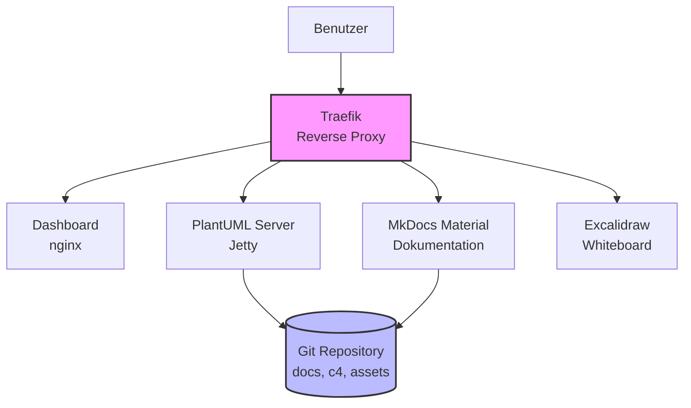
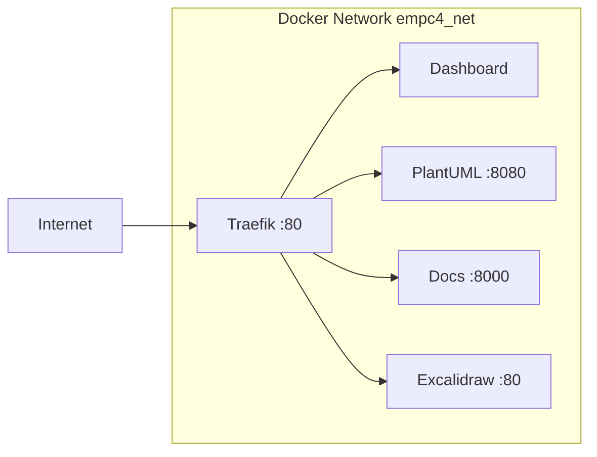
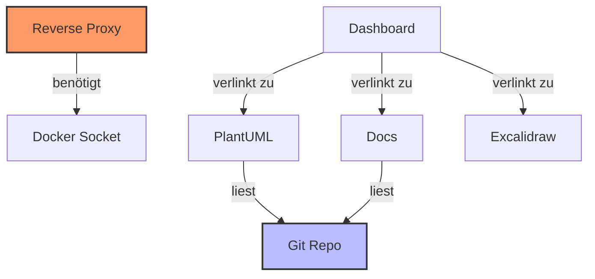

# Architektur-Übersicht

## High-Level-Architektur



## Komponenten

### 1. Reverse Proxy (Traefik)

**Image**: `traefik:v2.11`

**Aufgaben**:
- Routing aller eingehenden Requests
- Service Discovery über Docker Labels
- Optional: TLS-Termination (HTTPS)
- Dashboard für Monitoring

**Ports**:
- `80`: HTTP-Eingang
- `8080`: Traefik Dashboard

### 2. Dashboard (nginx)

**Image**: `nginx:stable-alpine`

**Aufgaben**:
- Zentrale Einstiegsseite
- Übersicht aller verfügbaren Tools
- Statusanzeige
- Links zu allen Services

**Routing**: `/` (Root-Pfad)

### 3. PlantUML Server

**Image**: `plantuml/plantuml-server:jetty`

**Aufgaben**:
- Rendering von PlantUML-Diagrammen
- Unterstützung für C4-PlantUML
- API für IDE-Plugins
- Export als PNG/SVG

**Routing**: `/plantuml`

**Features**:
- Live-Preview für IDEs
- Batch-Verarbeitung für CI/CD
- Unterstützung für große Diagramme (8192px)

### 4. Dokumentations-Server (MkDocs)

**Image**: `squidfunk/mkdocs-material:latest`

**Aufgaben**:
- Statische Dokumentation aus Markdown
- Mermaid-Diagramm-Rendering
- Suchfunktion
- Responsive Design

**Routing**: `/docs`

**Plugins**:
- Material Theme
- Mermaid2 Plugin
- Search Plugin

### 5. Excalidraw (Whiteboard)

**Image**: `kiliandangendorf/excalidraw:latest`

**Aufgaben**:
- Interaktives Whiteboard
- Architektur-Skizzen
- Workshop-Tool
- Export als PNG/SVG

**Routing**: `/whiteboard`

## Netzwerk-Architektur

Alle Services befinden sich im gemeinsamen Docker-Netzwerk `empc4_net`:



## Daten-Persistenz

### Git Repository

Alle Architekturinhalte werden im Git-Repository gespeichert:

```
repo/
├── docs/           # Markdown-Dokumentation
├── c4/             # PlantUML C4-Diagramme
└── assets/         # Bilder, Excalidraw-Exports
    └── excalidraw/
```

### Volume-Mounts

- **PlantUML**: `./repo` → `/repo` (read-only)
- **Docs**: `./repo` → `/docs` (read/write für Build)
- **Dashboard**: `./dashboard/dist` → `/usr/share/nginx/html` (read-only)

## Healthchecks

Alle Services haben konfigurierte Healthchecks:

| Service | Check-Interval | Timeout | Start Period |
|---------|---------------|---------|--------------|
| Dashboard | 30s | 10s | 10s |
| PlantUML | 30s | 10s | 20s |
| Docs | 30s | 10s | 40s |
| Excalidraw | 30s | 10s | 15s |

## Service-Abhängigkeiten



## Sicherheitsaspekte

### Aktuelle Konfiguration

- HTTP-only (Port 80)
- Keine Authentifizierung
- Docker Socket read-only für Traefik
- Repository read-only für PlantUML

### Geplante Erweiterungen

- HTTPS/TLS mit Let's Encrypt
- Basic Auth für Admin-Bereiche
- OAuth2-Proxy für SSO
- Rate Limiting

## Performance-Überlegungen

- **PlantUML**: Limit Size auf 8192px für große Diagramme
- **MkDocs**: Plugin-Installation beim Start (ca. 30-40s)
- **Traefik**: Docker Provider mit automatischer Service-Discovery
- **Healthchecks**: Start Period berücksichtigt Initialisierungszeit
