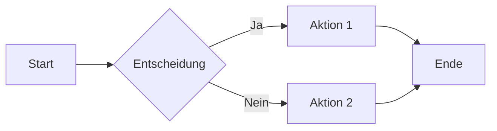
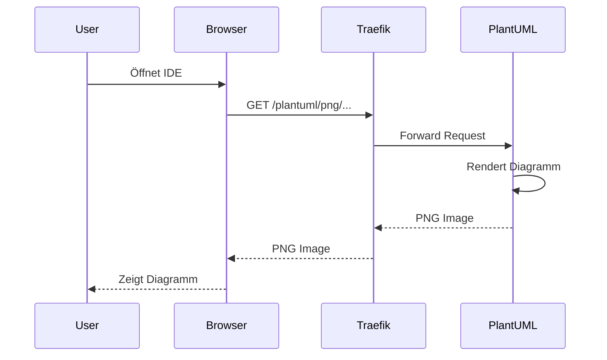
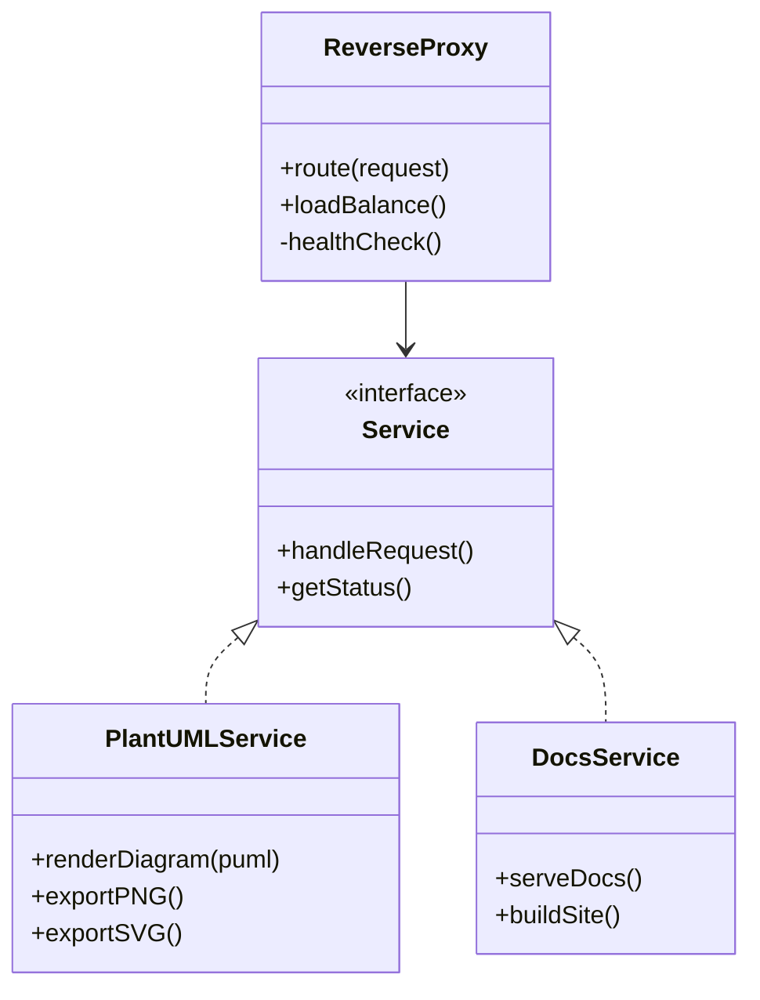
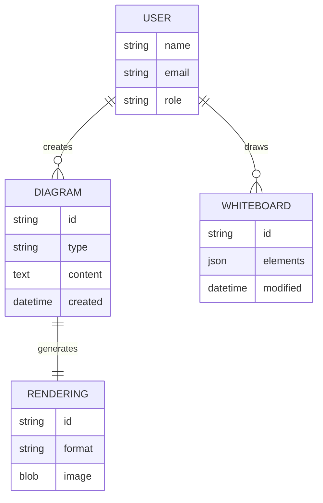
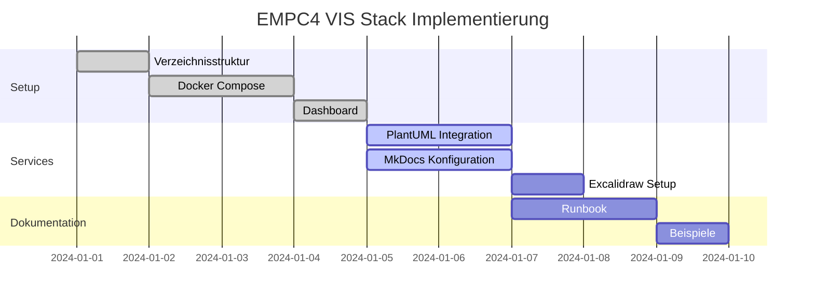
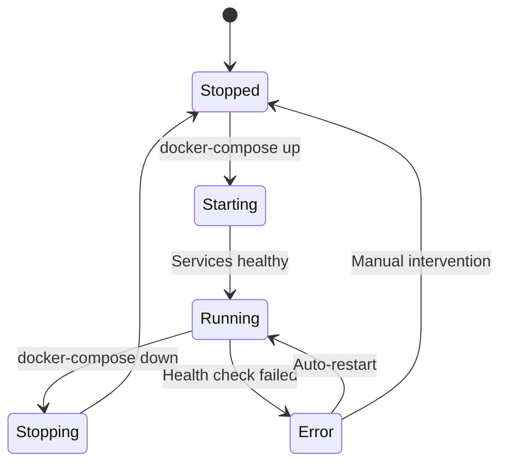
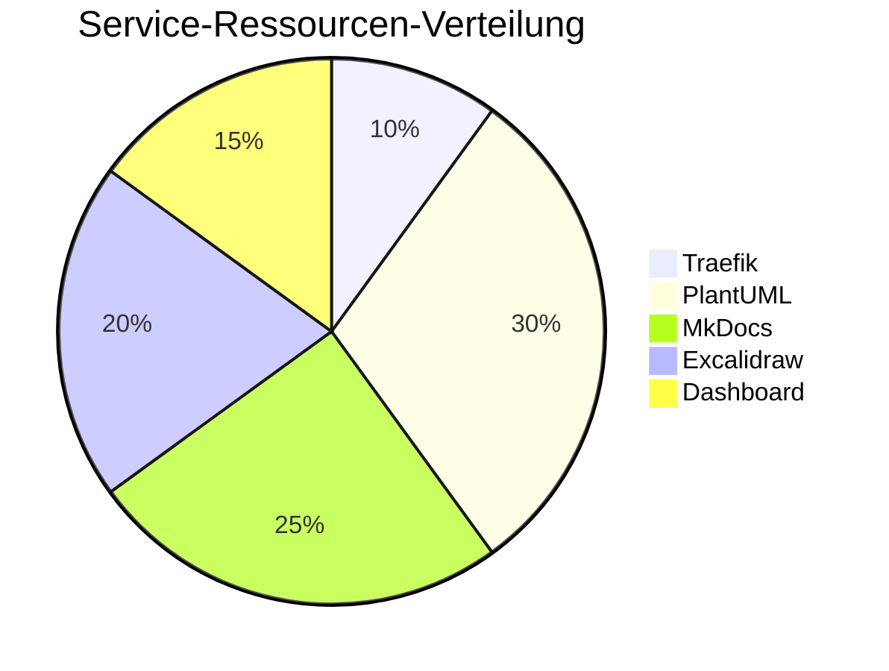
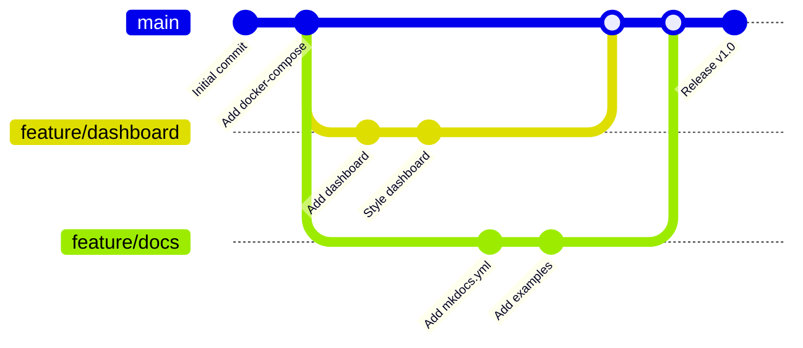
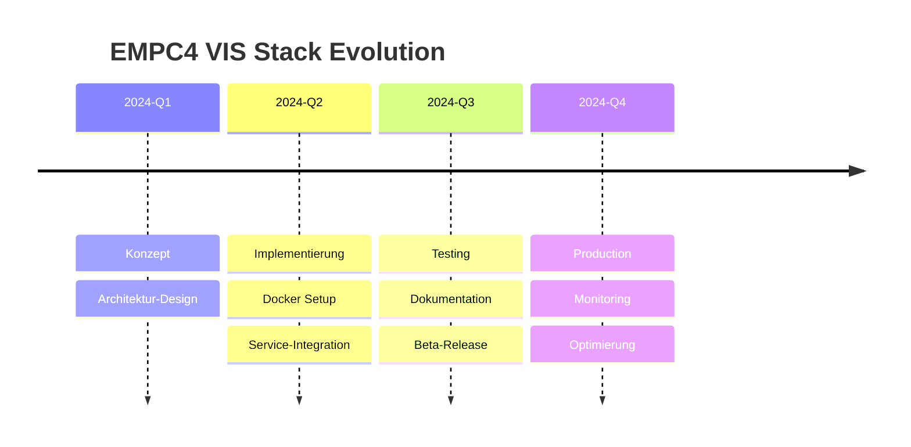

# Mermaid-Diagramme

Mermaid ermöglicht es, Diagramme direkt in Markdown zu schreiben. Die Rendering erfolgt automatisch beim Build.

## Flussdiagramme

## Sequenzdiagramme

## Klassendiagramme

## ER-Diagramme

## Gantt-Diagramme

## Zustandsdiagramme

## Pie Charts

## Git Graph

## Timeline (experimentell)

## Tipps für Mermaid

!!! tip "Syntax-Highlighting"
    In deiner IDE kannst du Mermaid-Syntax-Highlighting mit Extensions aktivieren:

    - VS Code: [Mermaid Preview](https://marketplace.visualstudio.com/items?itemName=bierner.markdown-mermaid)
    - IntelliJ: [Mermaid Plugin](https://plugins.jetbrains.com/plugin/20146-mermaid)

!!! warning "Browser-Kompatibilität"
    Mermaid wird im Browser gerendert. Stelle sicher, dass JavaScript aktiviert ist.

!!! info "Theme-Anpassung"
    Das Mermaid-Theme folgt automatisch dem MkDocs Material Theme (Dark/Light Mode).
