# PlantUML-Beispiele

PlantUML ist ein mächtiges Tool für "Diagram as Code". Hier sind praktische Beispiele.

## Basis-Nutzung

### Im Browser

1. Öffne [http://arch.local/plantuml](http://arch.local/plantuml)
2. Füge deinen PlantUML-Code ein
3. Klicke auf "Submit" zum Rendern

### API-Nutzung

PlantUML bietet verschiedene Endpunkte:

```bash
# PNG-Export
curl http://arch.local/plantuml/png/[encoded] > diagram.png

# SVG-Export
curl http://arch.local/plantuml/svg/[encoded] > diagram.svg

# Text-basiert
curl http://arch.local/plantuml/txt/[encoded]
```

## Sequenzdiagramme


## Aktivitätsdiagramme

```plantuml
@startuml
start
:User startet docker-compose;
:Traefik initialisiert;
if (Services verfügbar?) then (ja)
  :Registriere Services;
  :Start Routing;
  :Dashboard verfügbar;
  stop
else (nein)
  :Warte auf Services;
  :Health Checks;
  if (Alle healthy?) then (ja)
    :Registriere Services;
    stop
  else (nein)
    :Logge Fehler;
    :Stoppe Container;
    stop
  endif
endif
@enduml
```



## Komponentendiagramme


## Deployment-Diagramme


## Zustandsdiagramme


## Timing-Diagramme


## Mind Maps


## Work Breakdown Structure (WBS)


## Netzwerk-Diagramme


## Archimate Diagrams


## YAML-Visualisierung


## Tipps für PlantUML

!!! tip "Encoding für URLs"
    PlantUML URLs verwenden ein spezielles Encoding. Es gibt **3 Optionen**:
    
    **Option 1: Docker-Service (empfohlen für Batch-Processing)**
    ```bash
    docker compose run --rm plantuml-tools encode repo/c4/beispiel-context.puml
    ```
    
    **Option 2: Lokales Python-Script (schnell für einzelne Dateien)**
    ```bash
    # Installation:
    pip install -r scripts/requirements-plantuml.txt
    
    # Nutzung:
    python scripts/plantuml_encode.py repo/c4/beispiel-context.puml
    ```
    
    **Option 3: Programmatische Nutzung**
    ```python
    # Installation: pip install plantuml
    from plantuml import deflate_and_encode
    
    encoded = deflate_and_encode("@startuml\nAlice -> Bob\n@enduml")
    url = f"http://arch.local/plantuml/png/{encoded}"
    ```
    
    📚 **Siehe auch:** [PlantUML Python Integration](../../docs/20251127_plantuml_python_integration.md)

!!! warning "Performance"
    Sehr komplexe Diagramme können Rendering-Zeit benötigen. Nutze:
    - `PLANTUML_LIMIT_SIZE` für große Diagramme
    - Caching in CI/CD
    - SVG statt PNG für große Outputs

!!! info "Includes"
    Nutze `!include` für wiederverwendbare Komponenten:
    ```plantuml
    @startuml
    !include repo/c4/includes/styles.puml
    !include https://raw.githubusercontent.com/plantuml-stdlib/C4-PlantUML/master/C4_Container.puml
    @enduml
    ```
