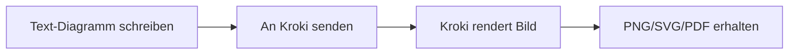
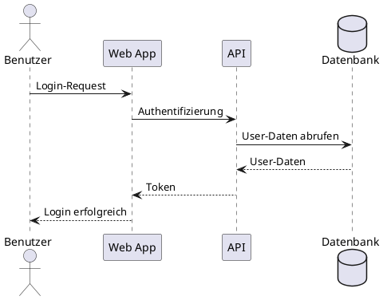
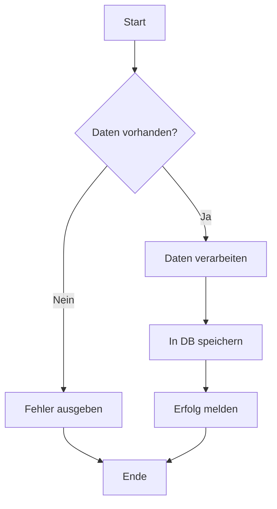
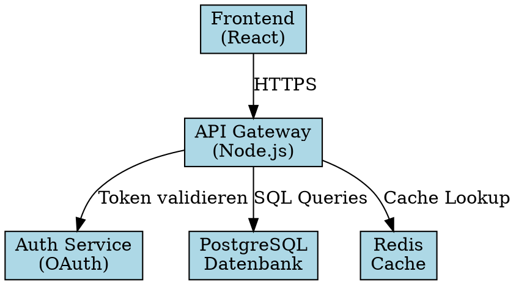

# Kroki - Universal Diagram Service

Kroki ist ein universeller Diagramm-Service, der über 20 verschiedene text-basierte Diagramm-Formate unterstützt. Statt für jedes Format einen eigenen Service zu betreiben, bietet Kroki eine einheitliche API für alle Diagrammtypen.

## Überblick

### Was ist Kroki?

Kroki wandelt Text-Beschreibungen in visuelle Diagramme um. Du schreibst dein Diagramm in einer speziellen Syntax (wie PlantUML, Mermaid, GraphViz), sendest es an Kroki, und erhältst ein fertiges Bild (PNG, SVG, PDF) zurück.

**Vorteile:**

- ✅ **Eine API** für 20+ Formate
- ✅ **Versionierbar** - Diagramme als Text in Git
- ✅ **Automatisierbar** - Integration in CI/CD
- ✅ **Keine Installation** - Service läuft zentral
- ✅ **Konsistent** - Gleiche Verwendung für alle Formate

### Unterstützte Formate

Kroki unterstützt diese Diagramm-Formate:

| Kategorie | Formate |
|-----------|---------|
| **UML & Architektur** | PlantUML, C4-PlantUML, Nomnoml, Structurizr |
| **Flowcharts** | Mermaid, GraphViz (DOT), Erd |
| **Business** | BPMN |
| **Netzwerk** | BlockDiag, NwDiag, SeqDiag, ActDiag, PacketDiag, RackDiag |
| **ASCII Art** | Ditaa, Svgbob |
| **Daten-Visualisierung** | Vega, Vega-Lite |
| **Hardware** | WaveDrom, Bytefield |
| **Sonstige** | Pikchr, Excalidraw (text format) |

## Grundlegendes Konzept

### Workflow



### API-Methoden

Kroki bietet zwei Hauptmethoden:

#### 1. HTTP GET (mit Encoding)

Für kurze Diagramme, die als URL teilbar sein sollen:

```
GET /kroki/{diagram_type}/{output_format}/{encoded_diagram}
```

**Beispiel:**
```
http://arch.local/kroki/plantuml/svg/eNpLzkksLlZw...
```

#### 2. HTTP POST (ohne Encoding)

Für längere Diagramme oder einfachere Verwendung:

```
POST /kroki/{diagram_type}/{output_format}
Content-Type: text/plain

[Diagramm-Text hier]
```

**Beispiel:**
```bash
curl -X POST http://arch.local/kroki/plantuml/svg \
  -H "Content-Type: text/plain" \
  -d '@startuml
Alice -> Bob: Hello
@enduml'
```

## Anwendungsbeispiele

### Beispiel 1: PlantUML Sequence Diagram

**Text-Beschreibung:**


**PowerShell-Aufruf:**
```powershell
$diagram = @"
@startuml
actor Benutzer
participant "Web App" as WA
participant "API" as API
database "Datenbank" as DB

Benutzer -> WA: Login-Request
WA -> API: Authentifizierung
API -> DB: User-Daten abrufen
DB --> API: User-Daten
API --> WA: Token
WA --> Benutzer: Login erfolgreich
@enduml
"@

Invoke-RestMethod -Uri "http://arch.local/kroki/plantuml/svg" `
  -Method Post `
  -ContentType "text/plain" `
  -Body $diagram `
  -OutFile "login-sequence.svg"
```

### Beispiel 2: Mermaid Flowchart

**Text-Beschreibung:**


**PowerShell-Aufruf:**
```powershell
$mermaid = @"
graph TD
    Start[Start] --> Check{Daten vorhanden?}
    Check -->|Ja| Process[Daten verarbeiten]
    Check -->|Nein| Error[Fehler ausgeben]
    Process --> Save[In DB speichern]
    Save --> Success[Erfolg melden]
    Error --> End[Ende]
    Success --> End
"@

Invoke-RestMethod -Uri "http://arch.local/kroki/mermaid/svg" `
  -Method Post `
  -ContentType "text/plain" `
  -Body $mermaid `
  -OutFile "workflow.svg"
```

### Beispiel 3: GraphViz Architektur-Diagramm

**Text-Beschreibung:**


**PowerShell-Aufruf:**
```powershell
$graphviz = @"
digraph Architecture {
    rankdir=TB;
    node [shape=box, style=filled, fillcolor=lightblue];

    Frontend [label="Frontend\n(React)"];
    API [label="API Gateway\n(Node.js)"];
    Auth [label="Auth Service\n(OAuth)"];
    DB [label="PostgreSQL\nDatenbank"];
    Cache [label="Redis\nCache"];

    Frontend -> API [label="HTTPS"];
    API -> Auth [label="Token validieren"];
    API -> DB [label="SQL Queries"];
    API -> Cache [label="Cache Lookup"];
}
"@

Invoke-RestMethod -Uri "http://arch.local/kroki/graphviz/svg" `
  -Method Post `
  -ContentType "text/plain" `
  -Body $graphviz `
  -OutFile "architecture.svg"
```

### Beispiel 4: C4 Context Diagram

**Text-Beschreibung:**
```c4plantuml
@startuml
!include https://raw.githubusercontent.com/plantuml-stdlib/C4-PlantUML/master/C4_Context.puml

LAYOUT_WITH_LEGEND()

title System Context Diagram für Online-Shop

Person(customer, "Kunde", "Ein Benutzer des Online-Shops")
Person(admin, "Administrator", "Verwaltet Produkte und Bestellungen")

System(shop, "Online-Shop System", "Ermöglicht Kunden das Bestellen von Produkten")
System_Ext(payment, "Payment Gateway", "Externe Zahlungsabwicklung")
System_Ext(shipping, "Versand-API", "Externe Versanddienstleister")

Rel(customer, shop, "Bestellt Produkte", "HTTPS")
Rel(admin, shop, "Verwaltet System", "HTTPS")
Rel(shop, payment, "Verarbeitet Zahlungen", "API")
Rel(shop, shipping, "Erstellt Versandlabel", "API")
@enduml
```

**PowerShell-Aufruf:**
```powershell
$c4 = @"
@startuml
!include https://raw.githubusercontent.com/plantuml-stdlib/C4-PlantUML/master/C4_Context.puml

LAYOUT_WITH_LEGEND()

title System Context Diagram für Online-Shop

Person(customer, "Kunde", "Ein Benutzer des Online-Shops")
Person(admin, "Administrator", "Verwaltet Produkte und Bestellungen")

System(shop, "Online-Shop System", "Ermöglicht Kunden das Bestellen von Produkten")
System_Ext(payment, "Payment Gateway", "Externe Zahlungsabwicklung")
System_Ext(shipping, "Versand-API", "Externe Versanddienstleister")

Rel(customer, shop, "Bestellt Produkte", "HTTPS")
Rel(admin, shop, "Verwaltet System", "HTTPS")
Rel(shop, payment, "Verarbeitet Zahlungen", "API")
Rel(shop, shipping, "Erstellt Versandlabel", "API")
@enduml
"@

Invoke-RestMethod -Uri "http://arch.local/kroki/c4plantuml/svg" `
  -Method Post `
  -ContentType "text/plain" `
  -Body $c4 `
  -OutFile "c4-context.svg"
```

### Beispiel 5: BPMN Business Process

**Text-Beschreibung:**
```bpmn
<?xml version="1.0" encoding="UTF-8"?>
<definitions xmlns="http://www.omg.org/spec/BPMN/20100524/MODEL">
  <process id="order-process" name="Bestellprozess">
    <startEvent id="start" name="Bestellung erhalten"/>
    <task id="validate" name="Bestellung validieren"/>
    <task id="payment" name="Zahlung durchführen"/>
    <task id="ship" name="Ware versenden"/>
    <endEvent id="end" name="Bestellung abgeschlossen"/>

    <sequenceFlow sourceRef="start" targetRef="validate"/>
    <sequenceFlow sourceRef="validate" targetRef="payment"/>
    <sequenceFlow sourceRef="payment" targetRef="ship"/>
    <sequenceFlow sourceRef="ship" targetRef="end"/>
  </process>
</definitions>
```

## Integration in Projekte

### MkDocs Integration

Installiere das Kroki-Plugin für MkDocs:

```bash
pip install mkdocs-kroki-plugin
```

**mkdocs.yml:**
```yaml
plugins:
  - kroki:
      ServerURL: http://arch.local/kroki
      FetchFormat: svg
```

**Verwendung in Markdown:**
```markdown
```kroki-plantuml
@startuml
Alice -> Bob: Hello
@enduml
```
```

### VS Code Extension

Installiere die Kroki-Extension:

```bash
code --install-extension pomdtr.kroki
```

**Konfiguration (.vscode/settings.json):**
```json
{
  "kroki.server": "http://arch.local/kroki"
}
```

### Python Integration

```python
import requests
import base64
import zlib

def render_diagram(diagram_text, diagram_type="plantuml", output_format="svg"):
    """
    Rendert ein Diagramm über Kroki API
    """
    # Methode 1: POST (einfach)
    url = f"http://arch.local/kroki/{diagram_type}/{output_format}"
    response = requests.post(url, data=diagram_text, headers={"Content-Type": "text/plain"})

    if response.status_code == 200:
        return response.content
    else:
        raise Exception(f"Kroki Error: {response.status_code}")

# Verwendung
diagram = """
@startuml
A -> B: Message
@enduml
"""

svg_content = render_diagram(diagram, "plantuml", "svg")
with open("diagram.svg", "wb") as f:
    f.write(svg_content)
```

### CI/CD Integration (GitHub Actions)

```yaml
name: Generate Diagrams

on: [push]

jobs:
  diagrams:
    runs-on: ubuntu-latest
    steps:
      - uses: actions/checkout@v3

      - name: Generate PlantUML diagrams
        run: |
          for file in diagrams/*.puml; do
            curl -X POST http://arch.local/kroki/plantuml/svg \
              -H "Content-Type: text/plain" \
              --data-binary @"$file" \
              -o "${file%.puml}.svg"
          done

      - name: Commit generated diagrams
        run: |
          git config user.name "GitHub Actions"
          git config user.email "actions@github.com"
          git add diagrams/*.svg
          git commit -m "Update generated diagrams" || true
          git push
```

## Best Practices

### 1. Diagramme versionieren

Speichere Diagramm-Definitionen als Text-Dateien in Git:

```
repo/
├── diagrams/
│   ├── architecture.puml
│   ├── workflow.mmd
│   └── network.dot
└── docs/
    └── assets/
        ├── architecture.svg (generiert)
        ├── workflow.svg (generiert)
        └── network.svg (generiert)
```

### 2. Automatische Generierung

Nutze Pre-Commit-Hooks oder CI/CD:

```bash
#!/bin/bash
# .git/hooks/pre-commit

for file in diagrams/*.puml; do
  curl -X POST http://arch.local/kroki/plantuml/svg \
    -H "Content-Type: text/plain" \
    --data-binary @"$file" \
    -o "docs/assets/$(basename ${file%.puml}).svg"
done
```

### 3. Konsistente Styles

Definiere Styles in Include-Dateien:

**styles/common.puml:**
```plantuml
!define PRIMARY_COLOR #4A90E2
!define SECONDARY_COLOR #50C878
!define ACCENT_COLOR #F5A623

skinparam backgroundColor white
skinparam sequenceArrowColor PRIMARY_COLOR
skinparam sequenceParticipantBackgroundColor SECONDARY_COLOR
```

**Verwendung:**
```plantuml
@startuml
!include styles/common.puml

Alice -> Bob: Hello
@enduml
```

### 4. Output-Formate

Wähle das richtige Format:

| Format | Verwendung | Vorteile |
|--------|------------|----------|
| **SVG** | Web, Docs | Skalierbar, klein |
| **PNG** | Präsentationen | Universell, pixelbasiert |
| **PDF** | Berichte | Druckbar, hochwertig |

## Troubleshooting

### Fehler: "Unable to decode"

**Problem:** Base64-Encoding ist falsch

**Lösung:** Nutze POST statt GET für komplexe Diagramme

### Fehler: "Syntax Error"

**Problem:** Diagramm-Syntax ist ungültig

**Lösung:** Teste zuerst mit Online-Editoren:
- PlantUML: https://plantuml.com/
- Mermaid: https://mermaid.live/

### Timeout-Fehler

**Problem:** Diagramm zu komplex oder Service überlastet

**Lösung:**
1. Diagramm vereinfachen
2. In mehrere kleinere Diagramme aufteilen
3. Timeout in nginx/Traefik erhöhen

## Weiterführende Ressourcen

- [Kroki Offizielle Dokumentation](https://kroki.io)
- [Kroki GitHub Repository](https://github.com/yuzutech/kroki)
- [PlantUML Guide](https://plantuml.com/guide)
- [Mermaid Documentation](https://mermaid.js.org/)
- [GraphViz Documentation](https://graphviz.org/documentation/)
- [C4 Model Guide](https://c4model.com/)

## Zusammenfassung

Kroki bietet eine **einheitliche API** für über 20 Diagramm-Formate:

✅ **Einfach:** Text → API → Bild
✅ **Flexibel:** Viele Formate, viele Output-Typen
✅ **Integrierbar:** VS Code, MkDocs, CI/CD
✅ **Versionierbar:** Text-basiert, Git-friendly

**Nächste Schritte:**
1. Probiere die [Beispiele](#anwendungsbeispiele) aus
2. Integriere Kroki in dein Projekt
3. Erstelle deine ersten Diagramme
4. Automatisiere die Generierung
