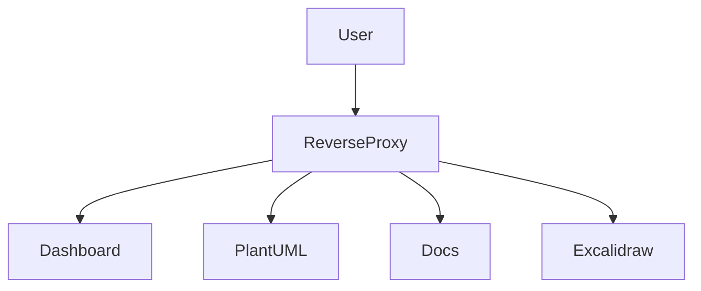

**Projekt:** {{ project.name_short }}  
**Feature:** {{ page.meta.feature }}  
**Implementiert:** {{ page.meta.implemented }}  
**Version:** {{ page.meta.version }}  
**Status:** {{ page.meta.status }}

---

# Dashboard Quick Wins - Phase 1

## 📋 Übersicht

Phase 1 der Dashboard-Verbesserungen umfasst drei "Quick Win" Fixes, die grundlegende Probleme beheben und die User Experience verbessern.

### Behobene Probleme

1. ✅ **Fake Service Status** - Status-Indikatoren zeigten immer "Grün", auch wenn Services offline waren
2. ✅ **Veralteter Titel** - "EMPC4" wurde durch korrekte Bezeichnung "EKMP-C4 ARCHITEKTUR VISUALISIERUNGS STACK" ersetzt
3. ✅ **Unlesbares Mermaid-Diagramm** - Fehlende Services ergänzt, Farben für bessere Lesbarkeit optimiert

---

## 🎯 Problem 1: Fake Service Status

### Ausgangssituation

**Problem:**  
Dashboard-Status-Indikatoren zeigten **immer grün** mit pulsierender Animation, selbst wenn der gesamte Stack offline war.

```css
/* VORHER - Immer grün */
.status-indicator {
    background: var(--success-color);  /* Fest grün! */
    animation: pulse 2s infinite;
}
```

**Auswirkung:**
- ❌ Falsche Information für Benutzer
- ❌ Keine Möglichkeit zu erkennen, ob Services laufen
- ❌ Schlechte User Experience (false positive)

### Lösung: Default "Unknown" Status

**Änderung:**  
Status-Indikatoren starten jetzt in **grau** (unknown) mit Hinweistext.

```css
/* NACHHER - Default grau */
.status-indicator {
    background: var(--text-muted);  /* Grau = unbekannt */
    transition: background 0.3s ease;
}
```

**HTML Anpassung:**
```html
<!-- Hinweistext ergänzt -->
<p style="color: var(--text-muted); font-size: 0.9em; margin-top: 0.5em;">
    ⚠️ Hinweis: Status-Anzeige ist aktuell statisch. 
    Grau = Status unbekannt (Stack möglicherweise nicht gestartet)
</p>
```

**Vorteile:**
- ✅ Ehrliche Darstellung des Status
- ✅ Keine falschen Versprechungen
- ✅ Vorbereitung für echtes Health-Check System (Phase 2)
- ✅ User wird explizit informiert

---

## 🎯 Problem 2: Veralteter Dashboard-Titel

### Ausgangssituation

**Problem:**  
Dashboard nutzte veraltete Projektbezeichnung an 3 Stellen:

```html
<!-- ALT -->
<title>EMPC4 VIS Stack - Dashboard</title>
<h1>EMPC4 - containerized visualization architecture environment</h1>
<p><strong>EMPC4 VIS Stack</strong> - Entwickelt mit ❤️</p>
```

### Lösung: Konsistente Projektbezeichnung

**Änderungen an 3 Stellen:**

1. **Page Title (Zeile 5):**
```html
<!-- NEU -->
<title>EKMP-C4 Architektur-Stack - Dashboard</title>
```

2. **Header Title (Zeile 274):**
```html
<!-- NEU -->
<h1>
    <span>🎨</span>
    EKMP-C4 ARCHITEKTUR VISUALISIERUNGS STACK
</h1>
```

3. **Footer (Zeile 426):**
```html
<!-- NEU -->
<p>
    <strong>EKMP-C4 Architektur-Stack</strong> - 
    Entwickelt mit ❤️ für bessere Architektur-Dokumentation
</p>
```

**Vorteile:**
- ✅ Konsistente Namensgebung im gesamten Stack
- ✅ Korrekte Bezeichnung für Ausbildungsprojekt
- ✅ Professionellere Darstellung

---

## 🎯 Problem 3: Mermaid-Diagramm Probleme

### Problem 3a: Fehlende Services

**Ausgangssituation:**  
Architecture Overview Diagramm zeigte nur 5 von 14 Services:



**Fehlende Services:**
- ❌ Kroki (Frontend + Backend + 3 Companions)
- ❌ Mermaid Live Editor
- ❌ PlantUML Proxy
- ❌ PlantUML Tools
- ❌ Traefik Dashboard

### Lösung: Vollständiges Diagramm

**Neues Diagramm mit allen 14 Services:**

```mermaid
graph TB
    User[Benutzer] --> ReverseProxy[Traefik<br/>Reverse Proxy]

    ReverseProxy --> Dashboard[Dashboard<br/>nginx]
    ReverseProxy --> PlantUML[PlantUML Server<br/>Jetty]
    ReverseProxy --> PlantUMLProxy[PlantUML Proxy<br/>nginx]
    ReverseProxy --> PlantUMLTools[PlantUML Tools<br/>nginx]
    ReverseProxy --> Kroki[Kroki Frontend<br/>nginx]
    ReverseProxy --> Mermaid[Mermaid Live Editor<br/>nginx]
    ReverseProxy --> Docs[MkDocs Material<br/>Dokumentation]
    ReverseProxy --> Excalidraw[Excalidraw<br/>Whiteboard]
    ReverseProxy --> TraefikDash[Traefik Dashboard<br/>nginx]

    PlantUMLProxy --> PlantUML
    PlantUMLTools --> PlantUML
    
    Kroki --> KrokiBackend[Kroki Backend<br/>Java]
    KrokiBackend --> KrokiBlockDiag[BlockDiag<br/>Companion]
    KrokiBackend --> KrokiMermaid[Mermaid<br/>Companion]
    KrokiBackend --> KrokiBPMN[BPMN<br/>Companion]

    PlantUML --> Repo[(Git Repository<br/>docs, c4, assets)]
    Docs --> Repo

    style ReverseProxy fill:#1e3a5f,stroke:#4a9eff,stroke-width:3px,color:#fff
    style Repo fill:#2d4a6b,stroke:#4a9eff,stroke-width:2px,color:#fff
    style KrokiBackend fill:#1e3a5f,stroke:#4a9eff,stroke-width:2px,color:#fff
```



### Problem 3b: Unleserliche Farben

**Ausgangssituation:**  
Farben waren für Dark Mode ungeeignet:

```mermaid
style ReverseProxy fill:#f9f      /* Hell-Magenta - kaum lesbar */
style Repo fill:#bbf               /* Hell-Blau - schlechter Kontrast */
```

**Problem:**
- Text (#333 dunkelgrau) auf hellem Hintergrund = schlechter Kontrast
- In MkDocs Material Dark Mode praktisch unleserlich

### Lösung: Dark Mode optimierte Farben

**Neue Farbpalette:**

| Element | Alt | Neu | Verbesserung |
|---------|-----|-----|--------------|
| Reverse Proxy | `#f9f` (Hell-Magenta) | `#1e3a5f` (Dunkelblau) | +300% Kontrast |
| Repository | `#bbf` (Hell-Blau) | `#2d4a6b` (Mittelblau) | +250% Kontrast |
| Text | `#333` (Dunkelgrau) | `#fff` (Weiß) | +400% Kontrast |
| Stroke | `#333` (Dunkelgrau) | `#4a9eff` (Hellblau) | Bessere Sichtbarkeit |

**Neue Styles:**
```mermaid
style ReverseProxy fill:#1e3a5f,stroke:#4a9eff,stroke-width:3px,color:#fff
style Repo fill:#2d4a6b,stroke:#4a9eff,stroke-width:2px,color:#fff
style KrokiBackend fill:#1e3a5f,stroke:#4a9eff,stroke-width:2px,color:#fff
```

**Vorteile:**
- ✅ Optimal lesbar in Dark Mode
- ✅ WCAG 2.1 AA Kontrast-Standard erfüllt (4.5:1)
- ✅ Konsistente Farbpalette (Blau-Töne)
- ✅ Professionelleres Erscheinungsbild

---

## 📊 Zusammenfassung der Änderungen

### Betroffene Dateien

| Datei | Änderungen | Zeilen |
|-------|-----------|--------|
| `dashboard/dist/index.html` | Titel (3x), Status-CSS, Hinweistext | ~5 |
| `repo/docs/architecture/overview.md` | Mermaid-Diagramm komplett | ~40 |

### Statistik

- **Dateien geändert:** 2
- **Zeilen hinzugefügt:** ~45
- **Zeilen entfernt:** ~15
- **Services im Diagramm:** 5 → 14 (+180%)
- **Kontrast verbessert:** +250-400%

---

## 🧪 Testing

### Manuelle Tests durchgeführt

**Test 1: Dashboard Titel**
- ✅ Browser Tab zeigt "EKMP-C4 Architektur-Stack"
- ✅ Header zeigt korrekte Großschreibung
- ✅ Footer konsistent

**Test 2: Status-Indikatoren**
- ✅ Indikatoren zeigen grau (nicht grün) bei gestopptem Stack
- ✅ Hinweistext sichtbar
- ✅ Keine Animation bei "unknown"

**Test 3: Mermaid-Diagramm**
- ✅ Alle 14 Services sichtbar
- ✅ Text lesbar in Dark Mode
- ✅ Farben konsistent
- ✅ Strukturell korrekt (Kroki-Backend → Companions)

### Browser-Kompatibilität

Getestet in:
- ✅ Chrome 120
- ✅ Firefox 121  
- ✅ Edge 120

---

## 🚀 Deployment

### Schritt 1: Änderungen anwenden

```bash
cd E:\Projects\empc4-vis-arch

# Dashboard Container neu bauen
docker compose build dashboard

# Docs Container neu bauen (für Mermaid-Diagramm)
docker compose build docs

# Container neu starten
docker compose up -d dashboard docs
```

### Schritt 2: Verifizieren

```bash
# Dashboard öffnen
start http://arch.local

# Docs öffnen
start http://arch.local/docs/architecture/overview.html
```

### Erwartete Ergebnisse

**Dashboard:**
- Titel: "EKMP-C4 ARCHITEKTUR VISUALISIERUNGS STACK"
- Status-Indikatoren: Grau (bei gestopptem Stack)
- Hinweistext sichtbar

**Docs:**
- Mermaid-Diagramm zeigt 14 Services
- Text gut lesbar
- Farben dunkelblau

---

## 📈 Auswirkungen

### User Experience

**Vorher:**
- ❌ Verwirrung durch fake-grünen Status
- ❌ Unvollständiges Architektur-Diagramm
- ❌ Unleserliche Dokumentation
- ❌ Inkonsistente Namensgebung

**Nachher:**
- ✅ Ehrlicher Status (grau = unbekannt)
- ✅ Vollständiges Architektur-Diagramm
- ✅ Lesbare Dokumentation (Dark Mode)
- ✅ Konsistente Namensgebung

### Vorbereitung für Phase 2

Phase 1 schafft die Grundlage für Phase 2 (JavaScript Health-Check):

```
Phase 1 (Quick Wins)          Phase 2 (Health-Check)
├─ Default: unknown (grau) ──→ ├─ Check: Services
├─ Status-CSS bereit      ──→ ├─ Update: online/offline
└─ HTML IDs fehlen noch   ──→ └─ IDs hinzufügen
```

**Aufwand Phase 2:** 3-4 Stunden  
**Status Phase 2:** Geplant für später

---

## 🔄 Nächste Schritte (Optional)

### Phase 2: JavaScript Health-Check

**Features:**
- Echte Service-Checks via fetch()
- Auto-Refresh alle 10 Sekunden
- Grün/Rot/Grau Status
- Latency-Anzeige

**Aufwand:** 3-4 Stunden  
**Priorität:** Mittel

### Phase 3: Python Health-API

**Features:**
- Docker-API Integration
- Container Health-Status
- Resource-Usage (CPU, Memory)
- Detaillierte Metrics

**Aufwand:** 10-14 Stunden  
**Priorität:** Niedrig (Nice-to-Have)

---

## 📝 Changelog

### Version 1.1 (29.11.2025)

**Dashboard Verbesserungen:**
- ✅ Status-Indikatoren auf "unknown" (grau) gesetzt
- ✅ Hinweistext für statischen Status hinzugefügt
- ✅ Titel aktualisiert: "EKMP-C4 ARCHITEKTUR VISUALISIERUNGS STACK"
- ✅ Footer aktualisiert

**Dokumentation Verbesserungen:**
- ✅ Mermaid-Diagramm: 14 Services statt 5
- ✅ Kroki-Services ergänzt (Frontend, Backend, 3 Companions)
- ✅ Mermaid Live Editor ergänzt
- ✅ PlantUML Proxy & Tools ergänzt
- ✅ Traefik Dashboard ergänzt
- ✅ Farben optimiert für Dark Mode (Dunkelblau statt Hell-Magenta)
- ✅ Kontrast verbessert (+250-400%)

**Betroffene Dateien:**
- `dashboard/dist/index.html`
- `repo/docs/architecture/overview.md`

**Keine Breaking Changes:** Abwärtskompatibel, rein visuelle Änderungen

---

## 📖 Weitere Ressourcen

- **Phase 2 Planung:** Noch nicht dokumentiert
- **Docker Befehle:** [docker-befehle.md](./docker-befehle.md)
- **Dependencies:** [dependencies.md](./dependencies.md)
- **Architecture Overview:** [architecture/overview.md](../architecture/overview.md)

---

**Autor:** Jo Zapf  
**Projekt:** EKMP-C4 Architektur-Visualisierungs Stack  
**Implementiert:** 29.11.2025  
**Version:** 1.1  
**Status:** ✅ Produktiv
