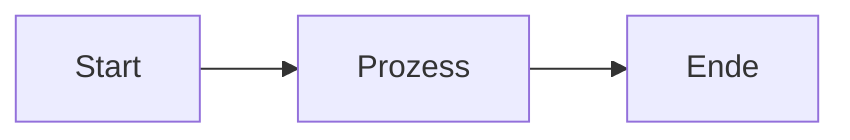

# MkDocs - Dokumentation hinzufügen

**Projekt:** EKMP-C4 Architektur-Visualisierungs Stack  
**Erstellt:** 23.11.2025  
**Autor:** Jo Zapf

---

## 📋 Übersicht

Diese Anleitung zeigt, wie du neue Markdown-Dateien zur MkDocs-Dokumentation hinzufügst.

**MkDocs-Struktur:**
```
repo/
├── mkdocs.yml              # ← Konfiguration & Navigation
└── docs/                   # ← Dokumentations-Quelle
    ├── index.md            # Startseite
    ├── architecture/
    ├── examples/
    ├── setup/              # ← Setup-Anleitungen
    └── ...
```

---

## 🚀 Schritt-für-Schritt: Neue Seite hinzufügen

### Schritt 1: Markdown-Datei erstellen

**Verzeichnisstruktur wählen:**

```bash
# Bestehende Verzeichnisse
repo/docs/
├── architecture/      # Für Architektur-Dokumentation
├── examples/          # Für Code-Beispiele
├── setup/             # Für Setup-Anleitungen
└── ...

# Neue Datei anlegen
# Beispiel: Setup-Anleitung für Docker
repo/docs/setup/docker-setup.md
```

**Datei erstellen:**
```bash
# Im Projekt-Root
cd repo/docs/setup
echo "# Docker Setup" > docker-setup.md
```

**Oder neues Verzeichnis:**
```bash
mkdir repo/docs/troubleshooting
echo "# Troubleshooting Guide" > repo/docs/troubleshooting/index.md
```

---

### Schritt 2: In Navigation eintragen

**Editiere:** `repo/mkdocs.yml`

```yaml
nav:
  - Home: index.md
  - Architektur:
    - Übersicht: architecture/overview.md
    - C4-Diagramme: architecture/c4-diagrams.md
  - Setup:
    - Navigation: setup/navigation.md
    - Docker Setup: setup/docker-setup.md      # ← NEU
  - Troubleshooting:                            # ← NEUE SEKTION
    - Übersicht: troubleshooting/index.md
```

**YAML-Syntax:**
- **Einrückung:** 2 Leerzeichen (KEINE Tabs!)
- **Sektionen:** Name + Colon (z.B. `- Setup:`)
- **Seiten:** Name + Colon + Pfad (z.B. `- Docker: setup/docker.md`)
- **Pfade:** Relativ zu `docs/` (ohne führendes `/`)

---

### Schritt 3: Container neu bauen

**Warum?** MkDocs baut die Seite beim Docker-Build, nicht zur Laufzeit!

```bash
# 1. Image neu bauen (lädt neue Dateien)
docker compose build --no-cache docs

# 2. Container neu starten
docker compose up -d docs

# 3. Logs prüfen (auf Fehler achten!)
docker compose logs docs --tail=50
```

**Häufige Fehler:**
```
ERROR - Config value 'nav': Unable to find the file 'setup/docker.md'
```
→ Datei existiert nicht oder Pfad ist falsch

---

### Schritt 4: Im Browser testen

**Öffne:** http://arch.local/docs

**Prüfe:**
- ✅ Neue Sektion erscheint in der Navigation
- ✅ Seite lädt ohne 404-Fehler
- ✅ Formatierung korrekt (Überschriften, Code-Blöcke, etc.)

**Hard-Refresh:** `Ctrl + Shift + R` (Chrome/Firefox)

---

## 📝 Markdown-Formatierung

### Überschriften

```markdown
# Hauptüberschrift (H1)
## Unterüberschrift (H2)
### Sub-Unterüberschrift (H3)
```

### Code-Blöcke

**Mit Syntax-Highlighting:**
````markdown
```python
def hello():
    print("Hello World")
```
````

**Inline-Code:**
```markdown
Verwende `docker compose up` zum Starten.
```

### Admonitions (Info-Boxen)

```markdown
!!! info "Information"
    Dies ist eine Info-Box.

!!! warning "Warnung"
    Dies ist eine Warnung.

!!! danger "Gefahr"
    Kritischer Hinweis!

!!! tip "Tipp"
    Hilfreicher Tipp für dich.
```

### Links

```markdown
[Interner Link](../architecture/overview.md)
[Externer Link](https://example.com)
```

### Listen

```markdown
- Punkt 1
- Punkt 2
  - Unterpunkt 2.1
  - Unterpunkt 2.2

1. Nummeriert
2. Nummeriert
```

### Tabellen

```markdown
| Spalte 1 | Spalte 2 |
|----------|----------|
| Wert 1   | Wert 2   |
| Wert 3   | Wert 4   |
```

### Mermaid-Diagramme

````markdown

````

---

## 🎨 MkDocs Material Features

### Tabs

```markdown
=== "Tab 1"
    Inhalt für Tab 1
    
=== "Tab 2"
    Inhalt für Tab 2
```

### Aufklappbare Bereiche

```markdown
??? "Klicke zum Aufklappen"
    Versteckter Inhalt hier
```

### Code mit Dateinamen

````markdown
```python title="hello.py"
print("Hello World")
```
````

---

## 📂 Verzeichnisstruktur-Empfehlung

```
docs/
├── index.md                    # Startseite
├── architecture/               # Architektur-Dokumentation
│   ├── overview.md
│   ├── c4-diagrams.md
│   └── data-flow.md
├── setup/                      # Setup & Installation
│   ├── navigation.md
│   ├── docker-setup.md
│   └── network-config.md
├── examples/                   # Code-Beispiele
│   ├── mermaid.md
│   ├── plantuml.md
│   └── api-usage.md
├── troubleshooting/            # Fehlerbehebung
│   ├── index.md
│   ├── docker-issues.md
│   └── network-issues.md
├── reference/                  # API-Referenz
│   └── rest-api.md
└── changelog.md                # Änderungshistorie
```

---

## 🔄 Workflow: Dokumentation aktualisieren

### 1. Datei bearbeiten

```bash
# Editiere bestehende Datei
vim repo/docs/setup/navigation.md

# Oder erstelle neue
echo "# Neue Seite" > repo/docs/setup/new-page.md
```

### 2. Navigation aktualisieren (falls neue Datei)

```yaml
# repo/mkdocs.yml
nav:
  - Setup:
    - Navigation: setup/navigation.md
    - Neue Seite: setup/new-page.md    # ← Hinzufügen
```

### 3. Lokal testen (optional)

**Mit MkDocs installiert:**
```bash
cd repo
mkdocs serve
# Öffne: http://localhost:8000
```

### 4. Container neu bauen

```bash
docker compose build --no-cache docs
docker compose up -d docs
```

### 5. Im Browser prüfen

http://arch.local/docs

---

## 🐛 Troubleshooting

### Problem: Seite erscheint nicht in Navigation

**Ursache:** Datei nicht in `mkdocs.yml` eingetragen

**Lösung:**
```yaml
# mkdocs.yml
nav:
  - Setup:
    - Deine Seite: setup/deine-seite.md  # ← Hinzufügen
```

### Problem: 404 - Seite nicht gefunden

**Ursache:** Falscher Pfad in `mkdocs.yml`

**Debug:**
```bash
# Prüfe ob Datei existiert
ls -la repo/docs/setup/deine-seite.md

# Prüfe Pfad in mkdocs.yml (relativ zu docs/)
cat repo/mkdocs.yml | grep -A 5 "nav:"
```

**Lösung:** Pfad korrigieren:
```yaml
# FALSCH (mit führendem Slash)
- Seite: /setup/page.md

# RICHTIG (relativ zu docs/)
- Seite: setup/page.md
```

### Problem: Formatierung falsch

**Ursache:** Markdown-Syntax-Fehler

**Debug:**
```bash
# Prüfe MkDocs Logs
docker compose logs docs | grep ERROR
```

**Häufige Fehler:**
- Code-Block nicht geschlossen (fehlende Backticks)
- Falsche Einrückung bei Listen
- YAML-Syntax-Fehler in mkdocs.yml

### Problem: Änderungen werden nicht angezeigt

**Ursache:** Browser-Cache oder Container nicht neu gebaut

**Lösung:**
```bash
# 1. Container komplett neu bauen
docker compose down docs
docker compose build --no-cache docs
docker compose up -d docs

# 2. Browser: Hard-Refresh
# Chrome/Firefox: Ctrl + Shift + R
# Safari: Cmd + Shift + R
```

### Problem: YAML-Syntax-Fehler in mkdocs.yml

**Fehlermeldung:**
```
yaml.scanner.ScannerError: mapping values are not allowed here
```

**Ursache:** Falsche Einrückung oder Tabs statt Leerzeichen

**Lösung:**
```yaml
# FALSCH (Tabs verwendet)
nav:
	- Home: index.md

# RICHTIG (2 Leerzeichen)
nav:
  - Home: index.md
```

**Prüfen mit:**
```bash
# YAML-Syntax validieren
python3 -c "import yaml; yaml.safe_load(open('repo/mkdocs.yml'))"
```

---

## 📚 Weitere Ressourcen

**MkDocs Material Dokumentation:**
- https://squidfunk.github.io/mkdocs-material/
- https://squidfunk.github.io/mkdocs-material/reference/

**MkDocs Dokumentation:**
- https://www.mkdocs.org/

**Markdown Guide:**
- https://www.markdownguide.org/

---

## ✅ Checkliste: Neue Seite hinzufügen

- [ ] Markdown-Datei erstellt (`repo/docs/...`)
- [ ] In `mkdocs.yml` Navigation eingetragen
- [ ] YAML-Syntax geprüft (2 Leerzeichen, kein Tab)
- [ ] Pfad relativ zu `docs/` (ohne führenden `/`)
- [ ] Container neu gebaut (`docker compose build --no-cache docs`)
- [ ] Container gestartet (`docker compose up -d docs`)
- [ ] Logs geprüft (keine Fehler)
- [ ] Im Browser getestet (http://arch.local/docs)
- [ ] Hard-Refresh gemacht (Ctrl+Shift+R)
- [ ] Navigation funktioniert
- [ ] Formatierung korrekt

---

**Letzte Aktualisierung:** 23.11.2025  
**Dokumentations-Version:** 1.0
